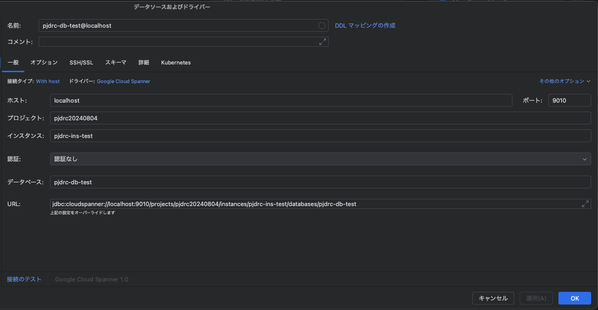
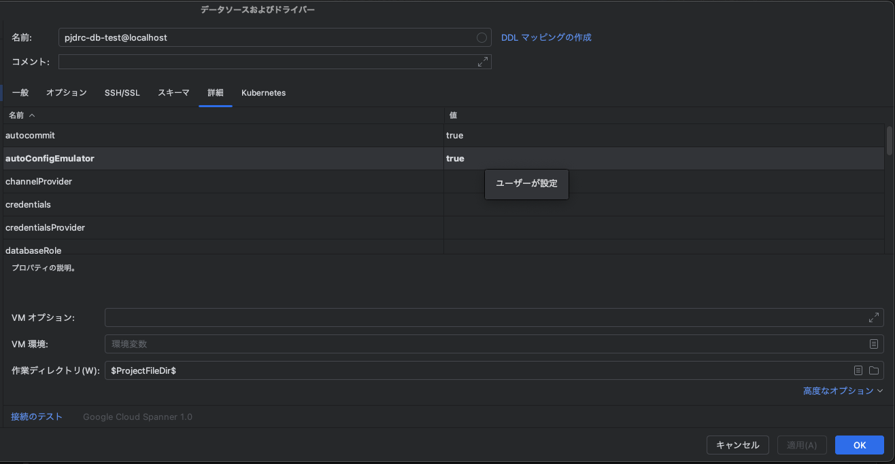
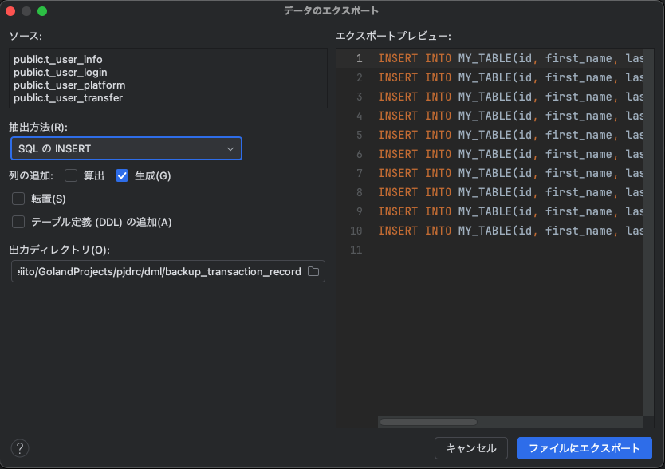
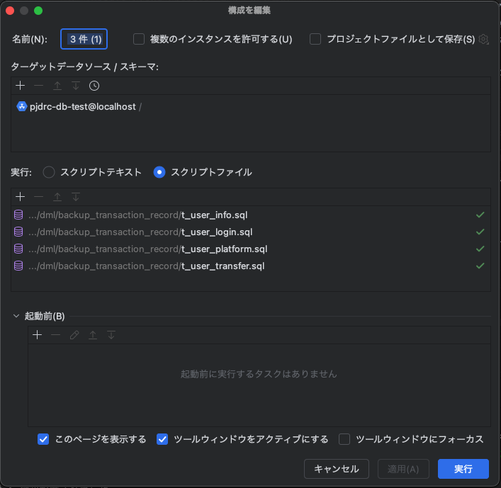

# Spannerのセットアップ手順
## 1. Spannerエミュレーターのセットアップ
### Docker環境にSpannerエミュレーターのイメージを落とします。
```
docker pull gcr.io/cloud-spanner-emulator/emulator
```
### Emulator を起動します。
```
docker run -d -p 9010:9010 -p 9020:9020 gcr.io/cloud-spanner-emulator/emulator
```
### エミュレータを gcloud で使用するには、認証を無効にしてエンドポイントをオーバーライドする必要があります(初回のみでOK)
```
gcloud config configurations create emulator
gcloud config set auth/disable_credentials true
gcloud config set project pjdrc20240804
gcloud config set api_endpoint_overrides/spanner http://localhost:9020/
```
## 2. インスタンス、データベースの作成、DDL流し込み
### インスタンス作成
```
gcloud spanner instances create pjdrc-ins-test --config=emulator-config --description="PJDRC Emu Instance" --nodes=1
```
### データベースの作成
```
gcloud spanner databases create pjdrc-db-test --instance=pjdrc-ins-test --database-dialect=POSTGRESQL
```
### DDL流し込み
```
gcloud spanner databases ddl update pjdrc-db-test --instance=pjdrc-ins-test --ddl="ここにpjdrc/ddl/ddl_output.txtのテキストをコピペ"
```
#### WindowsのPowerShellで実行した場合、上記のコマンドで「PowerShellでこのシステムではスクリプトの実行が無効になっているため」のエラーが出た場合、以下のコマンドを実行
```
Set-ExecutionPolicy -ExecutionPolicy RemoteSigned -Scope Process
```
### 現在のデータベースのDDL表示
```
gcloud spanner databases ddl describe pjdrc-db-test --instance=pjdrc-ins-test --project=pjdrc20240804
```
### 現在のDDLを保存(オプション)
```
gcloud spanner databases ddl describe pjdrc-db-test --instance=pjdrc-ins-test --project=pjdrc20240804 > ddl/ddl_output.txt
```
## 3. リセット(※今までの手順をやり直したい場合は)
### データベース削除
```
gcloud spanner databases delete pjdrc-db-test --instance=pjdrc-ins-test
```
### インスタンスの削除
```
gcloud spanner instances delete pjdrc-ins-test
```

### DMLの実行(オプション)
レコードの挿入などのデータ操作はDMLコマンドから実行可能
```
gcloud spanner databases execute-sql pjdrc-db-test --instance=pjdrc-ins-test --sql="ここにSQLを記載"
```
## 3.Golandの環境設定
### Spannerエミュレーターのポート設定
「実行/デバッグ構成」の画面を開く。開き方はGoland上部のメニューの「実行」選択後、「実行構成の編集…」から開ける
「Goビルド」の項目が「go build pjdrc/cmd」になっているのを確認し、構成->環境(V)の項目に以下の環境変数を設定する
SPANNER_EMULATOR_HOST=localhost:9010
<br>次に「プログラムの引数」の項目に「-server_env "local"」と記入する。記入後、適応選択後OK選択
### Goモジュールの設定
Gokandの設定画面を開き、Go->Goモジュール->環境に以下の環境変数を設定
```
SPANNER_EMULATOR_HOST=host.docker.internal:9010
```

記入後、適用、OKを選択
### Golandのデータベース設定
Golandの画面右上の歯車アイコンの下に並んでいるアイコン一覧に「データベース」の項目があるので、選択。
「+」アイコンの新規を選択し、データソースから「その他」を選択。一覧の中に「Google Cloud Spanner」があるので選択。
データベースおよびドライバー画面の「一般」タブを以下のような構成にする。

次に「詳細」タブを開き以下のように「autoConfigEmulator」の設定をtrueにします。

接続のテストを行い、成功確認後、適用、OKを選択します。
## 4.Spannerエミュレーター環境のDBバックアップとリストア
エミュレーター環境のSpannerにはマネージドサービスのSpannerにあるデータのダンプやリストアの機能はありません。
代わりにGolandのデータベース関連の補助機能を使用してデータのバックアップとリストアを実行します。
### DBのバックアップ
GolandからDBのバックアップを行うには前章「3.Golandの環境設定」が終わっている必要があります。
バックアップ用のSQL実行前に必ず以下のフォルダの中にあるSQLを実行します。  
[prev_sql](../dml/backup_transaction_record/prev_sql)  
次にGolandのデータベース画面からトランザクションテーブル(テーブル名が「t_」から始まるてテーブル)
を全て選択した上で右クリックをして、「インポート/エクスポート」->「データをファイルにエクスポート」を選択します。  

以下の画面のように出力ディレクトリが[backup_transaction_record](../dml/backup_transaction_record) に設定し、ファイルにエクスポートを選択します。

### DBのリストア
以下のフォルダにあるsqlを全て実行してください(全選択後右クリックから「....sqlおよび他の実行」から実行できます)  
[delete_transaction_record](../dml/delete_transaction_record)  
前項目「DBのバックアップ」で生成したトランザクションテーブルのsqlを全て選択し、右クリック->「....sqlおよび他の実行」選択後、「構成の編集」画面が表示され、下記の設定になっているか確認します。

「ターゲットデータソース/スキーマ」に何も設定されていない場合は、「+」を選択し、「pjdrc-db-test@localhost」を選択してください。  
実行を選択すると、リストアが開始されます。


